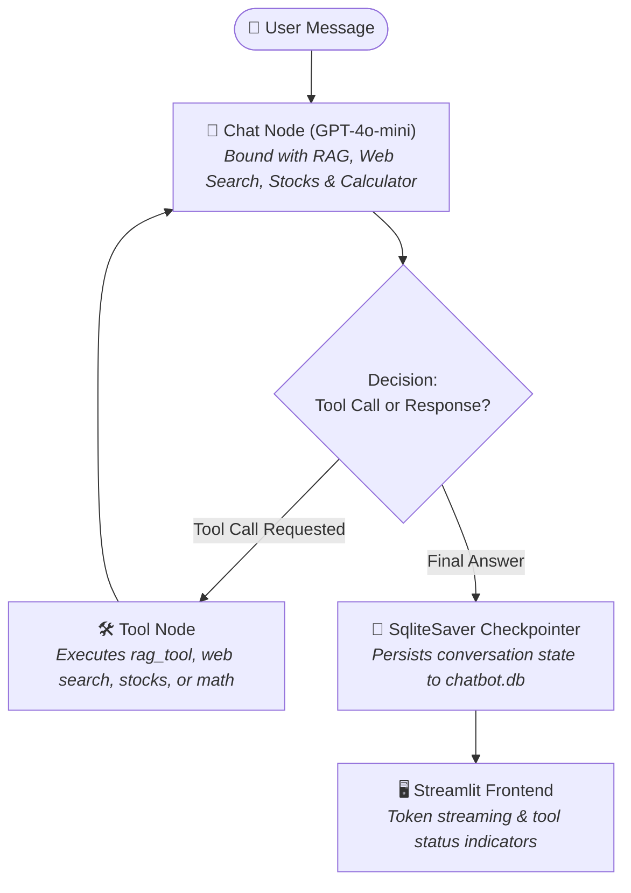

# 🤖 Multi-Utility AI Chatbot with RAG & Agentic Tools

[](https://ai-chatbot-04.streamlit.app/)
[](https://github.com/langchain-ai/langgraph)
[](https://openai.com/)
[](https://www.python.org/)

An advanced, production-grade conversational AI system built using **LangGraph**, **LangChain**, **OpenAI GPT-4o-mini**, **FAISS**, and **Streamlit**.

The system combines **Retrieval-Augmented Generation (RAG)** over user-uploaded PDF documents with an **autonomous tool-calling agent**, supported by persistent multi-thread conversation management powered by **SQLite checkpointing**.

---

## 🌐 Live Deployments & Demo

| Service | Environment | URL | Status |
| :--- | :--- | :--- | :--- |
| **Interactive Chatbot App** | Streamlit Cloud | [ai-chatbot-04.streamlit.app](https://ai-chatbot-04.streamlit.app/) | 🟢 Live |

---

## 🌟 Key Features

- 📄 **Per-Thread PDF RAG**: Upload any PDF document to chat with it instantly. Uses `PyPDFLoader`, `RecursiveCharacterTextSplitter`, `OpenAIEmbeddings (text-embedding-3-small)`, and in-memory `FAISS` vector search isolated per thread.
- 🛠️ **Multi-Tool Autonomous Agent**: Dynamically invokes external tools based on user intent:
  - 📖 `rag_tool`: Semantic retrieval over the uploaded PDF chunks for the current conversation thread.
  - 🌐 `DuckDuckGoSearchRun`: Live web searching for up-to-date information and current events.
  - 🧮 `calculator`: Accurate arithmetic calculations (`add`, `sub`, `mul`, `div`).
  - 📈 `get_stock_price`: Real-time stock market data via Alpha Vantage API.
- 💾 **State Persistence & Multi-Threading**: Backed by LangGraph's `SqliteSaver` (`chatbot.db`), allowing users to create separate conversation threads, switch between past chats, and resume conversations without data loss.
- ⚡ **Real-Time Token Streaming**: Streams AI responses in real-time using `chatbot.stream(..., stream_mode="messages")`.
- 🔧 **Live Tool Execution Indicators**: Visual feedback via Streamlit's `st.status` widgets showing tool calls (e.g. `🔧 Using rag_tool...`) as they execute.
- 🧩 **Extensive Architecture Suite**: Also includes implementations exploring **Model Context Protocol (MCP)**, **Human-In-The-Loop (HITL)** approval workflows, and automated **ReportLab PDF generation**.

---

## 🏗️ Architecture & Workflow

The core application (`streamlit_rag_frontend.py` + `langgraph_rag_backend.py`) implements a cyclic LangGraph state machine with checkpointing:



---

## 📂 Repository Structure

```plaintext
chatbot/
├── streamlit_rag_frontend.py            # 🚀 MAIN Frontend: Streamlit PDF RAG & Tool Calling UI
├── langgraph_rag_backend.py             # 🧠 MAIN Backend: LangGraph RAG agent with FAISS & tools
│
├── Hacathon_chatbot_backend.py          # 🏆 Hackathon Edition: RAG + Tools + ReportLab PDF export
├── Hacathon_chatbot_frontend.py         # 🏆 Hackathon Frontend: Streamlit UI with PDF report generation
│
├── langgraph_mcp_backend.py             # 🔌 MCP Edition: Model Context Protocol agent (SSE/HTTP)
├── streamlit_frontend_mcp.py            # 🔌 MCP Frontend: Streamlit UI for remote MCP tool servers
│
├── simple_chatbot_with_hitl_using_tools.py # 👤 Human-In-The-Loop (HITL) agent with LangGraph interrupt()
├── simple_chatbot_without_hitl_using_tools.py # 🤖 Automated tool-calling agent baseline
│
├── langgraph_backend.py                 # 🧱 Basic LangGraph in-memory chatbot
├── streamlit_frontend.py                # 🧱 Basic Streamlit frontend
├── langgraph_database_backend.py        # 🗄️ Database-backed LangGraph chatbot (SqliteSaver)
├── streamlit_frontend_database.py       # 🗄️ Frontend with database thread persistence
├── langgraph_tool_backend.py            # 🔨 Tool-augmented LangGraph chatbot
├── streamlit_frontend_tool.py           # 🔨 Frontend with tool execution
├── streamlit_frontend_streaming.py      # 🌊 Demonstration of token streaming
├── streamlit_frontend_threading.py      # 🧵 Demonstration of multi-thread management
│
├── chatbot.db                           # 💾 SQLite database for conversation checkpoints
├── requirements.txt                     # 📦 Python dependencies
└── .env                                 # 🔑 API configuration keys
```

---

## ⚙️ Prerequisites & Installation

### 1. Clone the Repository
```bash
git clone https://github.com/joel799659/ChatBot_langgraph_llm.git
cd ChatBot_langgraph_llm
```

### 2. Create and Activate a Virtual Environment
```bash
python3 -m venv myenv
source myenv/bin/activate   # On Windows: myenv\Scripts\activate
```

### 3. Install Dependencies
```bash
pip install -r requirements.txt
```

---

## 🔑 Environment Configuration

Create a `.env` file in the root directory and configure your keys:

```ini
# OpenAI API Key (Required for GPT-4o-mini and text-embedding-3-small)
OPENAI_API_KEY="your-openai-api-key"

# Optional: LangSmith Tracing for monitoring and observability
LANGCHAIN_TRACING_V2=true
LANGCHAIN_ENDPOINT="https://api.smith.langchain.com"
LANGCHAIN_API_KEY="your-langsmith-api-key"
LANGCHAIN_PROJECT="langgraph-chatbot"
```

---

## 🚀 Running the Application

### 1. Launch the Main RAG & Tool Application (Recommended)
Run the primary application:

```bash
streamlit run streamlit_rag_frontend.py
```

Open your browser at `http://localhost:8501`.

#### Using the Application:
1. **Upload a PDF**: Use the sidebar file uploader to index any PDF document. The app extracts text, generates vector embeddings with `text-embedding-3-small`, and builds a per-thread FAISS index.
2. **Ask Questions**: Ask questions about your document. The assistant calls `rag_tool` to retrieve the most relevant sections.
3. **Use Agentic Tools**:
   - Ask for current events: *"What are the latest developments in AI?"* (Calls `DuckDuckGoSearchRun`)
   - Ask for financial data: *"What is the stock price of Apple?"* (Calls `get_stock_price`)
   - Solve calculations: *"Multiply 4829 by 37"* (Calls `calculator`)
4. **Switch or Start New Chats**: Use the sidebar to create new threads or reload past conversations stored in SQLite.

---

### 2. Exploring Other Architectures in this Repo

- **Model Context Protocol (MCP)**:
  Connects to remote MCP tool servers via SSE and HTTP:
  ```bash
  streamlit run streamlit_frontend_mcp.py
  ```

- **Human-In-The-Loop (HITL) Workflow**:
  Demonstrates LangGraph's `interrupt()` primitive requiring human approval before executing sensitive operations (e.g. stock purchases):
  ```bash
  python simple_chatbot_with_hitl_using_tools.py
  ```

- **Hackathon Edition with PDF Report Generation**:
  Combines RAG, tools, and automatic ReportLab PDF generation:
  ```bash
  streamlit run Hacathon_chatbot_frontend.py
  ```

---

## 🛠️ Tech Stack

| Component | Technology | Purpose |
| :--- | :--- | :--- |
| **Agent Framework** | [LangGraph](https://github.com/langchain-ai/langgraph) | Cyclic graph state machine, branching, and checkpointing |
| **LLM Orchestration** | [LangChain Core & Community](https://github.com/langchain-ai/langchain) | Tool binding, prompt templates, and message schemas |
| **Language Model** | OpenAI `gpt-4o-mini` | Reasoning, intent routing, and natural response generation |
| **Embeddings** | OpenAI `text-embedding-3-small` | High-accuracy semantic document vector representations |
| **Vector Index** | [FAISS](https://github.com/facebookresearch/faiss) | Fast in-memory dense vector similarity search |
| **Document Parsing** | `PyPDFLoader` (`pypdf`) | PDF extraction and document processing |
| **Web Search** | DuckDuckGo (`ddgs`) | Zero-config web search retrieval |
| **Protocol Extensions** | [Model Context Protocol (MCP)](https://modelcontextprotocol.io/) | Standardized connectivity to remote microservice tools |
| **Checkpoint Storage** | SQLite (`SqliteSaver` / `aiosqlite`) | Thread-isolated persistence for multi-session chat histories |
| **Web UI** | [Streamlit](https://streamlit.io/) & [Streamlit Cloud](https://streamlit.io/cloud) | Chat dashboard with token streaming and cloud hosting |

---

## 📄 License

This project is licensed under the [MIT License](LICENSE).
